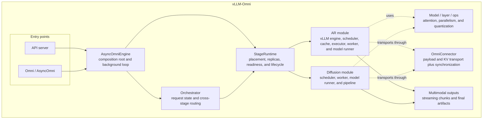
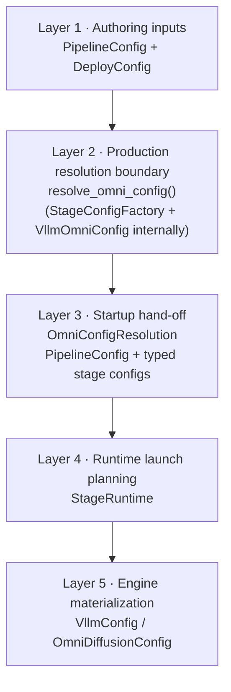
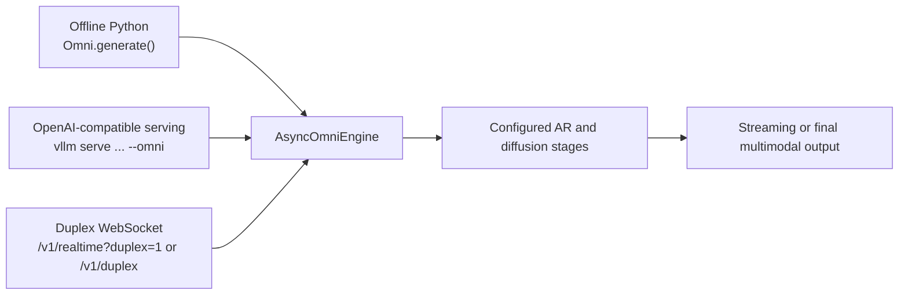

# Architecture Overview

This document outlines the architecture of vLLM-Omni.

<p align="center">
  <picture>
    <source media="(prefers-color-scheme: dark)" src="https://raw.githubusercontent.com/vllm-project/vllm-omni/refs/heads/main/docs/source/architecture/omni-modality-model-architecture.png">
    
  </picture>
</p>

## Design goals

The primary goal of vLLM-Omni is to provide a fast and easy-to-use inference
and serving engine for omni-modality models. vLLM-Omni extends vLLM's
text-oriented autoregressive (AR) runtime with stage-based execution for
non-textual outputs and non-autoregressive model components.

The architecture is designed to:

* support text, image, audio, video, and action inputs and outputs;
* compose autoregressive, generation, and diffusion stages in one pipeline;
* reuse vLLM scheduling, cache, distributed-execution, and serving
  primitives where they fit; and
* keep model topology, deployment placement, runtime lifecycle, transport,
  and public API concerns in separate layers.

## Model execution

These four examples show how vLLM-Omni maps model components to stage-local
execution policies. Each summary covers the model-owned path, batching,
attention, parallelism, quantization, and primary serving targets. The profiles
are representative; a model may support multiple `PipelineConfig` and
`DeployConfig` combinations.

| Model | Model-owned path | vLLM-Omni stage view | Primary serving target |
| --- | --- | --- | --- |
| Qwen3-Omni | Thinker → Talker → Code2Wav | Three stages with asynchronous chunk hand-off | TTFT/TTFP, TPOT, E2EL, audio RTF, and concurrent throughput |
| HunyuanImage-3.0 | Multimodal AR understanding/reasoning plus image-generation DiT | AR-only, DiT-only, or split AR → DiT deployment | DiT E2EL/denoising latency and image throughput; TTFT/TPOT for AR tasks |
| MiniMax-H3 | Text encoder → task-specific FL2VA or Ref2VA DiT → video/audio VAE decoder | Three logical component/phase boundaries within one registered diffusion stage | Video/audio E2EL and media throughput; RTF when audio streaming is measured |
| Cosmos3 | Unified MoT reasoner tower plus diffusion generator tower | One diffusion pipeline materializes both towers inside the stage | Image/video/action E2EL and throughput; RTF for synchronized audio |

### Serving metric vocabulary

The target metric follows the output modality, not just the model name.

| Metric | Meaning in this document | Most useful for |
| --- | --- | --- |
| **TTFT** | Time to the first text token | AR reasoning or text output |
| **TPOT** | Time per output token after the first token | AR decode stages |
| **TTFP** | Time to the first streamed media packet, such as audio | Interactive speech and multimodal chat |
| **E2EL** | End-to-end latency from request admission to the final output | Image, video, audio, and action requests |
| **RTF** | Wall-clock processing time divided by generated audio duration; lower is faster than real time | Audio generation |
| **Throughput** | Requests, tokens, or media seconds produced per wall-clock second | Offline and concurrent serving |

### Qwen3-Omni: streaming AR pipeline

Qwen3-Omni illustrates a multi-stage streaming AR pipeline: Thinker → Talker →
Code2Wav. The [technical report](https://arxiv.org/abs/2509.17765) describes
the model components, and the figure shows the stage-level streaming schedule
used by vLLM-Omni.

<p align="center">
  <a href="https://github.com/vllm-project/vllm-omni/blob/main/docs/source/architecture/qwen3-omni-async-chunk.png">
    
  </a>
</p>

#### Model architecture by stage

| Stage | Model component | Stage output |
| --- | --- | --- |
| **Thinker** | AuT audio encoder, SigLIP2 vision encoder, and the 30B-total/3B-active Thinker MoE Transformer | Text tokens and conditioning for the Talker |
| **Talker** | 3B-total/0.3B-active Talker MoE Transformer with the MTP code-prediction path | Text tokens and audio codec tokens |
| **Code2Wav** | Approximately 200M-parameter ConvNet audio decoder | Waveform/audio chunks |

#### Representative stage execution

| Stage | Batching | Attention and execution | Parallelism | Quantization |
| --- | --- | --- | --- | --- |
| **Thinker** | Continuous batching with stage-local `max_num_seqs` and token budgets | vLLM KV-cached AR attention; CUDA Graph execution when the stage is not eager | Independent stage placement; use the AR runtime's configured tensor parallelism | Supported ModelOpt FP8/NVFP4 or AutoRound checkpoint paths target the Thinker; encoders remain BF16 in the documented paths |
| **Talker** | Continuous batching over autoregressive decode requests | KV-cached token decode with async-chunk output to Code2Wav | Independent stage placement; typically a separate GPU or replica from Thinker | BF16 baseline; no generic Talker quantization path is assumed |
| **Code2Wav** | Static/chunk batching for codec-to-waveform decode | Non-AR chunked audio decode; eager execution is commonly retained | Separate stage or colocated placement, depending on the deployment | BF16 baseline; keep codec/vocoder precision model-specific |

For this pipeline, the main serving target is interactive responsiveness:
TTFT for text, TTFP for the first audio packet, TPOT for autoregressive decode,
E2EL for the complete answer, and RTF/throughput for sustained audio serving.
Async chunking and streaming primarily reduce TTFP and improve stage overlap;
batching and CUDA Graphs primarily improve E2EL and throughput. See the
[Qwen3-Omni recipe](https://github.com/vllm-project/vllm-omni/blob/main/recipes/Qwen/Qwen3-Omni.md)
and [async chunk design](feature/async_chunk.md) for the deployment details.

### HunyuanImage-3.0: shared multimodal model, split deployment choices

HunyuanImage-3.0 illustrates a shared multimodal model with flexible AR, DiT,
and split AR → DiT deployment. The official [technical
report](https://arxiv.org/abs/2509.23951) provides the model view; the tables
below map it to vLLM-Omni stages.

<p align="center">
  <a href="https://github.com/Tencent-Hunyuan/HunyuanImage-3.0/blob/main/assets/framework.png">
    
  </a>
</p>

#### Model architecture by stage

| Stage or component | Model component | Stage output |
| --- | --- | --- |
| **AR understanding/reasoning** | Understanding and generation encoders feeding the Hunyuan-A13B decoder-only Transformer and text detokenizer | Text responses or image-generation conditioning |
| **Image generation** | Generation encoder, diffusion prediction path/Gen. Decoder, and the image VAE decode path | Image latents and final images |

The vLLM-Omni deployment may expose the AR path only, the DiT path only, or
both as an AR → DiT pipeline with a connector between them. That is a runtime
decomposition of the model's capabilities; it should not be read as a claim
that the published framework figure contains two unrelated backbones.

#### Representative stage execution

| Stage | Batching | Attention and execution | Parallelism | Quantization |
| --- | --- | --- | --- | --- |
| **AR** | Standard vLLM continuous batching when serving understanding/text tasks | KV-cached causal attention | Tensor/expert parallelism follows the selected AR deployment | Checkpoint-specific; do not infer DiT FP8 settings for the AR checkpoint |
| **DiT + VAE** | Request batching or step-wise batching; Hunyuan step batching with more than one request requires `TORCH_SDPA` | `TORCH_SDPA` is used because the model mixes causal and full attention | Validated profiles include TP4, TP2 + sequence parallelism, TP2 + CFG parallelism, and expert parallelism for MoE weights | Online FP8 and ModelOpt mixed FP8/NVFP4 are documented for the DiT; VAE precision stays separate |

Image generation is therefore measured mainly with per-image E2EL/denoising
latency, peak memory, and images-per-second throughput. TTFT and TPOT remain
meaningful for the optional AR understanding path, but they are not the right
headline metrics for the DiT path. See the
[HunyuanImage-3.0 recipe](https://github.com/vllm-project/vllm-omni/blob/main/recipes/Tencent/HunyuanImage-3.0-Instruct.md)
for the validated batching, attention, and quantization combinations.

### MiniMax-H3: conditioning, denoising, and decode

MiniMax-H3 combines text and reference-media encoding, task-specific denoising,
and media decoding. Standard serving co-locates these components in one diffusion
stage. The opt-in
[disaggregated topology](https://github.com/vllm-project/vllm-omni/blob/main/recipes/MiniMaxAI/MiniMax-H3-Disaggregated.md)
runs Qwen and the video/audio VAE encoders in Stage 0, then sends their conditioning
to a Stage 1 containing the DiTs and VAE decoders. The stage mapping follows the
implementation and serving recipe; the [release overview](https://minimaxi.com/blog/minimax-h3)
notes that a detailed technical report is forthcoming.

#### Model architecture by component

| Logical component | Model component | Component output |
| --- | --- | --- |
| **Text Encoder** | Tokenizer/processor and Qwen3-VL text encoder; vision/audio references are prepared alongside the text condition | Packed multimodal conditioning for denoising |
| **DiT** | Task-specific `FL2VA` DiT for text/first-frame generation or `Ref2VA` DiT for mixed references | Video and audio latent tokens |
| **VAE Decoder** | Video VAE and audio VAE decode the generated latents and assemble the synchronized output | Decoded video frames and stereo waveform, with FPS and audio sample rate metadata |

Both DiT partitions remain behind one task-selection point; `task` chooses
which partition runs.

#### Representative component execution

The following table describes the standard single-stage deployment.

| Logical component | Batching | Attention and execution | Parallelism | Quantization |
| --- | --- | --- | --- | --- |
| **Text Encoder** | Follows the diffusion request scheduler | Qwen3-VL attention and multimodal preprocessing | `--text-encoder-tp-size N` shards the encoder across the first `N` DiT ranks | BF16/FP32 baseline; the H3 DiT FP8 path does not quantize the text encoder |
| **DiT** | The current H3 implementation executes one generation request per diffusion batch; use concurrency for service-level throughput | cuDNN attention for the validated two-GPU consumer profile; TRTLLM attention or FlashAttention-4 on supported Blackwell profiles | TP2 plus text-encoder TP and Ulysses/VAE parallel groups on multi-GPU profiles; DLO/CPU offload trade memory for transfer time | Online FP8 applies to eligible DiT linears and is incompatible with layerwise offload |
| **VAE Decoder** | Decode follows each generation request; tile/patch work can be distributed even when denoising is not batched | VAE decode kernels rather than DiT attention | VAE patch parallelism and native tiled decode within the diffusion stage | BF16/FP32 baseline; the documented H3 FP8 path leaves both VAEs unchanged |

The primary target is video/audio E2EL and media throughput, with the logical
component boundaries making prompt encoding, denoising, and VAE decode costs
separately measurable. RTF is useful when the audio stream is evaluated
independently. TTFT and TPOT do not describe the main H3 generation path
because the user-visible output is diffusion media rather than a token stream.
The
[MiniMax-H3 recipe](https://github.com/vllm-project/vllm-omni/blob/main/recipes/MiniMaxAI/MiniMax-H3.md)
contains the hardware-specific profiles and warmup requirements.

### Cosmos3: unified MoT reasoner and generator

Cosmos3 illustrates a unified Mixture-of-Transformers (MoT) reasoner and
diffusion generator. The official [technical
report](https://research.nvidia.com/labs/cosmos-lab/cosmos3/technical-report.pdf)
and NVIDIA's [technical explanation](https://developer.nvidia.com/blog/develop-physical-ai-reasoning-world-and-action-models-with-nvidia-cosmos-3/)
provide the two-tower model view used below.

<p align="center">
  <a href="https://developer.nvidia.com/blog/develop-physical-ai-reasoning-world-and-action-models-with-nvidia-cosmos-3/">
    
  </a>
</p>

#### Model architecture by stage

| Stage or component | Model component | Stage output |
| --- | --- | --- |
| **Reasoner tower** | Autoregressive VLM path with causal attention over language and optional vision/action context; runs once per generation request | Discrete reasoning/context tokens |
| **Generator tower** | Diffusion path with full attention over the generator tokens and the reasoner K/V context; runs for each denoising step | Image, video, audio, or action tokens |
| **Shared pipeline** | `Cosmos3OmniDiffusersPipeline` plus modality encoders/decoders and VAE paths | Final image/video/audio or action response |

The reasoner and generator are model-owned components, not two independent
vLLM-Omni stages by default. The current Cosmos3 pipeline materializes both
inside one diffusion stage; model-level CPU offload can swap the reasoner and
generator components between their phases.

#### Representative stage execution

| Stage | Batching | Attention and execution | Parallelism | Quantization |
| --- | --- | --- | --- | --- |
| **Reasoner + generator pipeline** | Use request batching or step execution only when the selected pipeline advertises that capability; otherwise use `max_num_seqs=1` | Causal attention for reasoner tokens and full attention for diffusion tokens; the validated recipe uses a platform-selected aiter FlashAttention path with `TORCH_SDPA` fallback | Ulysses/context parallelism or tensor parallelism for the transformer; VAE tiling and layerwise/model-level offload address activation and weight memory | Online FP8 is supported for the diffusion pipeline; AutoRound/checkpoint-specific paths and quality validation remain separate from the BF16 baseline |

For Cosmos3, generation E2EL and output throughput are the primary targets.
Action-policy workloads add a control-loop latency target, while synchronized
audio workloads add RTF. TTFT/TPOT are appropriate for a reasoner-only service,
but not for the full diffusion generation path. See the
[Cosmos3 recipe](https://github.com/vllm-project/vllm-omni/blob/main/recipes/cosmos3/Cosmos3-Nano.md)
and [diffusion execution modes](../user_guide/diffusion/execution_modes.md)
for the current runtime choices.

## Why the stage-based architecture follows from these examples

The four representative pipelines show that omni-modality serving is not one
execution problem. Autoregressive decoding, diffusion denoising, multimodal
encoding, and media decoding have different scheduling, attention, parallelism,
memory, and quantization requirements. The architecture therefore needs a
unit that can be optimized and resourced independently while remaining part of
one request pipeline.

| Observation | Design implication | vLLM-Omni response |
| --- | --- | --- |
| AR, diffusion, encoder, and decoder components have different execution loops | One scheduler and one execution policy cannot fit every component | Specialized AR, generation, and diffusion stage runtimes |
| A model can be deployed as AR-only, DiT-only, or AR → DiT | Model structure must be separate from deployment topology | `PipelineConfig` describes logical stages and relationships; `DeployConfig` describes placement and resources |
| Text encoders, DiTs, and VAE decoders have different batch and memory behavior | Batching, attention, parallelism, and quantization must be stage-local | Each stage carries its own runtime and engine configuration |
| MiniMax-H3 can co-locate or logically split its text encoder and VAE decoder | A stage boundary should be configurable rather than forcing a process boundary | Logical stages can be co-located or assigned independent runtime placement |
| Qwen3-Omni transfers hidden states and codec chunks across stages | Large intermediate data needs typed transport and synchronization | `OmniConnector` transports payloads and KV-cache data without owning model routing |
| Requests span multiple stages and may be cancelled or produce ordered streaming output | Cross-stage request state needs a separate control plane | `Orchestrator` owns correlation, cancellation, routing state, and output ordering |
| Qwen3-Omni optimizes first-packet latency while image/video models optimize E2EL and throughput | Performance objectives must be model- and stage-aware | TTFT/TPOT/TTFP, E2EL, RTF, and throughput are measured according to the output modality |

This leads to a precise definition of a stage: it is a logical execution unit
with its own model component, execution policy, resource ownership, and
performance objectives. A stage is not necessarily a separate process. Cosmos3
keeps its reasoner and generator inside one diffusion pipeline, while
MiniMax-H3 exposes useful logical boundaries between text encoding, denoising,
and VAE decoding. Both are valid mappings of the same abstraction.

The resulting separation can be summarized as:

```text
Model structure       What is computed and how components are related
        ↓
PipelineConfig        Which logical stages exist and how they are connected
        ↓
Stage runtime policy  How each stage batches, attends, parallelizes, and quantizes
        ↓
DeployConfig           Where stages run, with which devices, replicas, and connectors
```

`AsyncOmniEngine` and `Orchestrator` coordinate the pipeline, `OmniConnector`
transports stage outputs, and `StageRuntime` materializes the selected
placement. This separation lets one logical model support multiple serving
topologies without coupling model code to process layout or deployment
resources.

## System architecture

The figure shows the main components of the stage-based runtime: entrypoints,
the shared `AsyncOmniEngine`, request orchestration, stage lifecycle
management, AR and diffusion execution modules, model/layer operations,
connector transport, and multimodal outputs. `AsyncOmniEngine` is the
composition root between the entrypoints and the orchestrator.



### Key components

| Component | Responsibility |
| --- | --- |
| **Entrypoints** | Translate offline, CLI, OpenAI-compatible, and duplex requests into engine operations and render outputs back to public protocols. |
| **Configuration resolution** | Combines pipeline topology, deployment settings, model metadata, and user overrides into a validated control-plane configuration. |
| **AsyncOmniEngine** | Owns engine composition, the background event loop, stage initialization, request submission, and output collection. |
| **Orchestrator** | Owns cross-stage request state, stage-to-stage routing, request correlation, cancellation, and output ordering. It does not own model selection or deployment placement. |
| **StageRuntime** | Expands logical stages into local or distributed replicas, starts stage clients and processes, and manages readiness, affinity, failure, and shutdown. |
| **AR runtime** | Extends vLLM's scheduler, KV-cache, worker, and model-runner path for omni-modality inputs and inter-stage outputs. |
| **Diffusion runtime** | Schedules and executes denoising workloads through diffusion executors, workers, pipelines, acceleration backends, and output materialization. |
| **OmniConnector** | Transports stage payloads and KV-cache data and provides synchronization. Connectors transport data; they do not choose the next logical stage. |
| **Multimodal outputs** | `MultimodalPayload` separates tensor content from metadata, while `OmniRequestOutput` carries pipeline and diffusion results through the common output path. |

## Configuration and runtime resolution

The control plane has five conceptual layers. Authoring inputs are resolved
once into a complete, transport-safe configuration before runtime processes are
started. This keeps stage topology and model capabilities distinct from
deployment placement and from process-local engine objects.

The figure shows only the primary hand-off object for each layer; the detailed
inputs, fields, and ownership rules are described below.



The production resolution boundary is `resolve_omni_config()` in
[`vllm_omni/config`](https://github.com/vllm-project/vllm-omni/tree/main/vllm_omni/config).
It delegates typed construction to `StageConfigFactory.create_from_model()` and
`VllmOmniConfig.from_pipeline_config()`, then returns an
`OmniConfigResolution` consumed by both `AsyncOmniEngine` and headless startup.
This envelope carries the effective `PipelineConfig` alongside typed
`stage_configs`, which `StageRuntime` consumes directly. Both views describe the
same resolved topology, including injected stages. Backend arguments are
projected from these typed stages when each engine is initialized.

In the typed path, each stage configuration derives from
`BaseVllmOmniStageConfig` and is specialized as
`VllmOmniARStageConfig`, `VllmOmniGenerationStageConfig`, or
`VllmOmniDiffusionStageConfig`. The request and engine-spec fields belong to the
control-plane boundary; the current implementation stores their equivalent
projections in the structured stage configuration and materializes
backend-specific engine objects during stage initialization.

The important ownership rules are:

1. `PipelineConfig` is the source of truth for stage topology, execution type,
   model capabilities, and stage relationships.
2. `DeployConfig` describes placement, replicas, devices, connectors, and
   deploy-time defaults; it does not redefine the model graph.
3. CLI and Python overrides are applied at the resolution boundary, with
   per-stage overrides taking precedence over global values where supported.
4. `OmniConfigResolution` is the sole startup hand-off. Its `pipeline_config`
   and typed `stage_configs` must describe the same
   topology.
5. `StageRuntime` owns launch planning and replica lifecycle. `ReplicaInitPlan`
   is runtime-private state, not a user configuration object.
6. `VllmConfig` and the enriched `OmniDiffusionConfig` are materialized in the
   process that owns the corresponding engine.

## Main features

The feature surface is grouped to match the
[feature design documents](index.md#feature-design-documents). This page
summarizes each feature's architectural role; the linked design document is
the source for configuration, compatibility, and implementation details.

### Runtime and stage execution

* **Disaggregated inference:** Logical stages can run in separate processes,
  devices, or nodes while the orchestrator preserves their declared
  relationships. `OmniConnector` implementations transfer stage data and
  control-plane metadata. See [Disaggregated Inference](feature/disaggregated_inference.md).
* **Asynchronous stage and output execution:** [Async Chunk](feature/async_chunk.md)
  forwards partial stage outputs as they become available. [Async Diffusion
  Output](feature/async_diffusion_output.md) overlaps device-to-host output
  packing with the next diffusion request, while [Async Omni Output
  Materialization](feature/omni_async_output_materialization.md) moves
  CPU-side payload construction off the AR decode critical path.
* **Automatic prefix caching:** [Automatic Prefix Caching in Omni Models](feature/prefix_caching.md)
  reuses KV-cache-aligned stage outputs and multimodal tensors for requests
  with common prefixes.

### Communication

* **OmniConnector transport:** The connector contract carries tensors, KV-cache
  data, and transport metadata across stage boundaries. The available
  implementations cover shared memory and multi-node Mooncake, Mori, and
  Yuanrong transports; see [Disaggregated Inference](feature/disaggregated_inference.md)
  for the connector choices and configuration model.

### Diffusion acceleration

* **Request and step batching:** [Diffusion Continuous Batching](feature/diffusion_continuous_batching.md)
  defines request-batch and step-batch execution, scheduler admission, and the
  common streaming output path.
* **Composable parallelism:** Diffusion stages can combine [CFG-Parallel](feature/cfg_parallel.md),
  [Expert Parallel](feature/expert_parallel.md), [HSDP](feature/hsdp.md),
  [Pipeline Parallel](feature/pipeline_parallel.md), [Sequence Parallel](feature/sequence_parallel.md),
  [Tensor Parallel](feature/tensor_parallel.md), and [VAE Patch Parallelism](feature/vae_parallel.md)
  according to the pipeline and hardware topology.
* **Attention and cache acceleration:** [Skip-Softmax](feature/skip_softmax.md),
  [Cache-DiT](feature/cache_dit.md), and [TeaCache](feature/teacache.md)
  provide backend and denoising-step optimizations without changing the
  stage contract.
* **Quantization and memory efficiency:** [Quantization](feature/quantization.md)
  resolves per-pipeline or per-component quantization configurations, while
  [Distributed Layerwise Offload](feature/offloader/distributed_layerwise_offload.md)
  streams diffusion blocks from host memory within the existing parallel
  topology.

## Interfaces

The public interfaces map onto the same engine and stage boundaries:



### Offline inference

The **Omni** class provides a Python interface for offline batched inference:

```python
from vllm_omni.entrypoints.omni import Omni

omni = Omni(model="Qwen/Qwen3-Omni-30B-A3B-Instruct")

om_inputs = {
    "prompt": prompt,
    "multi_modal_data": {
        "video": video_frames,
        "audio": audio_signal,
    },
}

outputs = omni.generate(om_inputs, sampling_params_list)
```

### Online serving

The OpenAI-compatible server uses the same stage configuration and engine
boundaries:

```bash
vllm serve Qwen/Qwen3-Omni-30B-A3B-Instruct --omni --port 8091
```

For example, a Qwen3-Omni chat request can contain text, image, audio, or
video content and a `sampling_params_list` for its configured stages. See the
[Qwen3-Omni serving example](../user_guide/examples/online_serving/qwen3_omni.md)
and the [examples](https://github.com/vllm-project/vllm-omni/tree/main/examples)
for complete requests.

Some pipelines expose additional OpenAI-compatible endpoints, such as joint
video/audio generation. Endpoint support remains model-specific; consult the
relevant model guide before assuming that every OpenAI route applies to every
pipeline.
