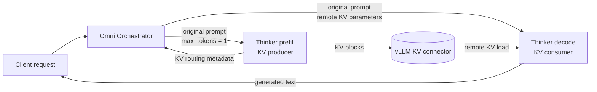

# Prefill-Decode (PD) Disaggregation (experimental)

!!! warning "Experimental design reference"
    PD disaggregation is only partially integrated on the current `main` branch.
    The runtime contains PD detection and routing scaffolding, but there is no
    supported deploy overlay or end-to-end validated launch recipe yet. Treat this
    page as a description of the current design, not as production guidance.

Prefill-decode disaggregation splits the Qwen3-Omni Thinker into two logical
stages: a prefill worker that processes the prompt and produces KV cache, and a
decode worker that imports that cache and generates tokens. The Talker and
Code2Wav stages remain downstream; PD does not disaggregate the entire
Qwen3-Omni pipeline.

## Current design

### Runtime topology

The orchestrator owns the request lifecycle, while the vLLM KV connector owns
the bulk KV transfer. The original prompt is submitted to both Thinker stages:
the decode worker still needs the request tokens and multimodal features to
construct its request, while the imported KV cache prevents it from repeating
the completed prefill computation.

For the full Qwen3-Omni pipeline, splitting the Thinker adds one logical stage:

| Stage | Role | Output or handoff |
| --- | --- | --- |
| 0 | Thinker prefill | Saves prompt KV and prompt-side multimodal output |
| 1 | Thinker decode | Loads remote KV, generates text, and produces decode-side conditioning |
| 2 | Talker | Converts combined Thinker conditioning into codec codes |
| 3 | Code2Wav | Converts codec codes into audio |

Text remains a final output of the decode stage, and audio remains a final
output of Code2Wav.

### Request lifecycle

1. At startup, PD detection looks for one stage marked `is_prefill_only` and
   one downstream stage marked `is_decode_only`. The decode stage must list the
   prefill stage as an input source.
2. The orchestrator clones the Thinker sampling parameters for prefill, forces
   `max_tokens=1`, clears stop conditions, and sets producer-side
   `kv_transfer_params`. This makes prefill finish by length after exporting KV.
3. When prefill finishes, the orchestrator captures its KV routing metadata and
   Qwen multimodal output under the original request ID.
4. The orchestrator submits the original prompt to decode with consumer-side
   `kv_transfer_params`. Those parameters identify the transfer, prefill engine,
   bootstrap endpoint, and, when required by the connector, remote request.
5. The decode engine imports the KV cache and continues generation. The normal
   Omni stage path then carries Thinker conditioning through Talker and
   Code2Wav.

### Control and data paths

PD uses two different connector layers. They solve different handoffs and are
not interchangeable.

| Path | Payload | Owner |
| --- | --- | --- |
| PD control path | Request ID, original prompt, `transfer_id`, bootstrap address, engine ID, and connector-specific request metadata | Omni Orchestrator |
| PD data path | Thinker attention KV blocks | vLLM KV connector |
| Downstream model path | Thinker hidden states and embeddings, Talker codec codes, and audio tensors | vLLM-Omni stage connectors and processors |

### Detection and validation

The current runtime accepts one logical prefill/decode pair per pipeline. Each
stage may use tensor parallelism, but both sides of the pair must satisfy these
invariants:

- both stages define `kv_transfer_config`
- prefill uses `kv_producer` or `kv_both`
- decode uses `kv_consumer` or `kv_both`
- both stages use the same KV connector
- `kv_buffer_device` and `kv_buffer_size` agree when set on both stages
- both stages use the same `tensor_parallel_size`

These checks happen before request processing so an inconsistent PD topology
fails during engine initialization.

## What is implemented today

| Area | Current state |
| --- | --- |
| Pair detection and topology validation | Implemented in the shared PD helper |
| Prefill sampling preparation | Implemented for sync and async entrypoints |
| Prefill-to-decode routing | Implemented in the current Orchestrator |
| Deploy-based configuration | Not yet migrated; the supported `stages:` deploy schema cannot currently expand Qwen3-Omni into the four-stage PD topology |
| Qwen3 Thinker-to-Talker handoff | Bridge state and embedding-merge helpers exist, but the merge is not wired into the live stage processor |
| Connector compatibility | Incomplete; the Orchestrator currently requires `remote_request_id`, while the pinned Mooncake connector completes prefill without returning that metadata |
| Validation coverage | PD entrypoint tests and the PD deploy overlay in online end-to-end tests are temporarily disabled during migration |
| Performance | No non-regression or throughput/latency result is established for the current path |

## Configuration contract under development

The intended deploy integration starts from the
[default Qwen3-Omni deploy config](gh-file:vllm_omni/deploy/qwen3_omni_moe.yaml)
and expands its frozen three-stage pipeline into the four stages shown above.
A complete integration must:

- split the Thinker definition without duplicating the Talker or Code2Wav model
  contracts
- remap downstream stage IDs, input sources, and stage connectors
- inject producer and consumer `kv_transfer_config` values into the two Thinker
  stages
- allocate separate device sets for prefill and decode
- preserve both final outputs: decode text and Code2Wav audio
- provide connector-specific routing metadata without hard-coding one connector
  contract

The required number of GPUs depends on tensor-parallel sizes and whether Talker
and Code2Wav share a device. A basic TP=1 layout uses one device for prefill, one
for decode, and one for the two downstream audio stages.

## Implementation map

- PD detection, validation, and sampling-parameter preparation:
  [`PDDisaggregationMixin`](gh-file:vllm_omni/entrypoints/pd_utils.py)
- startup detection and connector metadata:
  [`AsyncOmniEngine`](gh-file:vllm_omni/engine/async_omni_engine.py)
- request-scoped prefill-to-decode routing:
  [`Orchestrator`](gh-file:vllm_omni/engine/orchestrator.py)
- Qwen3 downstream conditioning helpers:
  [Qwen3-Omni stage input processor](gh-file:vllm_omni/model_executor/stage_input_processors/qwen3_omni.py)
